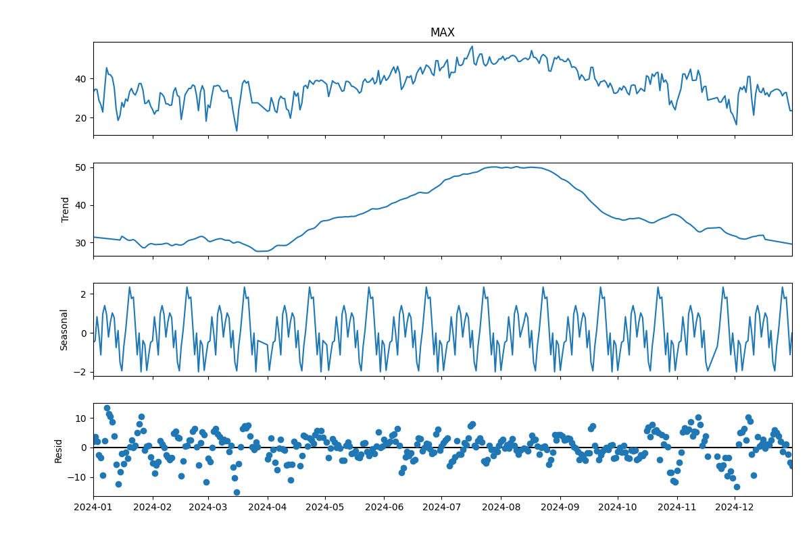

# Weather Data Processing with PySpark


**이 프로젝트는 다수 CSV 파일로 저장된 기상 데이터(일별 Tmax, Tmin 등)를 PySpark로 통합, 전처리하고 이상치 탐지 및 월별 평균 기온 계산을 수행합니다.**
시계열 분해(Seasonal Decompose)는 특정 지점 데이터를 Pandas로 변환 후 수행합니다.


## 🛠 사용 기술

- **언어/라이브러리**: Python, PySpark, pandas, NumPy, statsmodels, matplotlib, glob, os  
- **시각화**: matplotlib 기반 시계열 분해 그래프  
- **환경**: Linux 서버, Docker(선택적), 대용량 데이터 처리 환경  

## 📁 프로젝트 구조

weather-timeseries-spark/
├── data/                          # 원본 CSV 데이터 파일들
├── src/                          # 주요 PySpark 처리 코드
│   └── spark_analysis.py         # 전체 파이프라인 실행 스크립트
├── result/                       # 처리 결과 저장 폴더 (자동 생성)
├── requirements.txt              # Python 의존성 목록
└── README.md                     # 프로젝트 설명 문서

## 🚀 실행 방법

1. data/ 폴더에 CSV 파일들을 저장하세요.

2. spark_analysis.py 를 실행하세요:
```bash
python spark_analysis.py
```

## ✅ 주요 기능 설명

- **데이터 로드 및 병합**  
  여러 CSV 파일을 PySpark DataFrame으로 병합하고, 날짜 형식을 변환하여 시계열 분석에 적합한 형태로 준비합니다.

- **이상치 탐지 및 처리**  
  Z-score 기법을 활용해 MAX, MIN 기온 변수의 이상치를 탐지하고, 이상치를 NaN으로 처리한 뒤 시계열 보간법을 적용하여 결측값을 보완하며, 보간 후 남은 결측값은 중간값으로 대체하여 데이터 품질을 향상시킵니다.

- **데이터 정합성 검사**  
  중복 날짜 제거 및 MAX 기온이 MIN 기온보다 낮은 이상치를 필터링하여 신뢰성 높은 데이터를 유지합니다.

- **월별 평균 기온 계산**  
  각 지점별 월(month) 단위로 평균 최대 기온(MAX)을 계산하여 계절적 특성을 파악할 수 있습니다.

- **시계열 분해 (Seasonal Decomposition)**  
  PySpark에서 집계한 시계열 데이터를 pandas로 변환 후 statsmodels의 seasonal_decompose를 사용해 추세(trend), 계절성(seasonal), 잔차(residual) 성분으로 분해합니다.

- **결과 저장 및 시각화**  
  처리된 데이터 및 시계열 분해 결과를 CSV 파일로 저장하고, matplotlib 기반의 시계열 분해 플롯을 이미지로 출력합니다.


## 📦 산출물 예시

| 파일명                     | 설명                          |
|----------------------------|-------------------------------|
| `cleaned_weather.csv`       | 전처리 완료된 기상 관측 데이터  |
| `monthly_avg_tmax.csv`      | 지점별 월별 평균 최대 기온      |
| `outliers.csv`              | 이상치로 탐지된 데이터 기록    |
| `ts_decompose_trend.csv`    | 시계열 분해 결과 - 추세 성분   |
| `ts_decompose_seasonal.csv` | 시계열 분해 결과 - 계절성 성분 |
| `ts_decompose_resid.csv`    | 시계열 분해 결과 - 잔차 성분   |
| `ts_decompose_plot.png`     | 시계열 분해 시각화 그래프 이미지 |

## 📈 향후 개선 방향

- **분산 처리 최적화**  
  PySpark 클러스터 환경에서 리소스 활용을 극대화하기 위한 파티셔닝 및 캐싱 전략 고도화

- **고해상도 시계열 분석**  
  더 세밀한 시간 단위(예: 시간별) 데이터 처리 및 분석 기능 추가

- **다중 변수 시계열 분해**  
  온도 외에도 습도, 강수량 등 복합 기상 변수에 대한 다변량 시계열 분해 및 상관관계 분석 도입

- **이상치 탐지 고도화**  
  통계적 방법 외에 머신러닝 기반 이상치 탐지 기법 적용

- **자동화 및 배포**  
  Airflow와 연계한 정기 파이프라인 자동화 및 Docker, Kubernetes 기반 배포 환경 구축

- **인터랙티브 대시보드 연동**  
  분석 결과를 실시간으로 확인할 수 있는 대시보드(예: Dash, Streamlit) 개발

## 🧾 라이선스

본 프로젝트는 MIT 라이선스를 따릅니다.